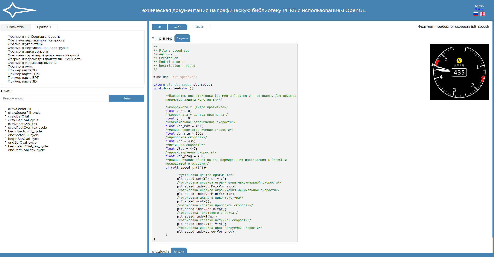
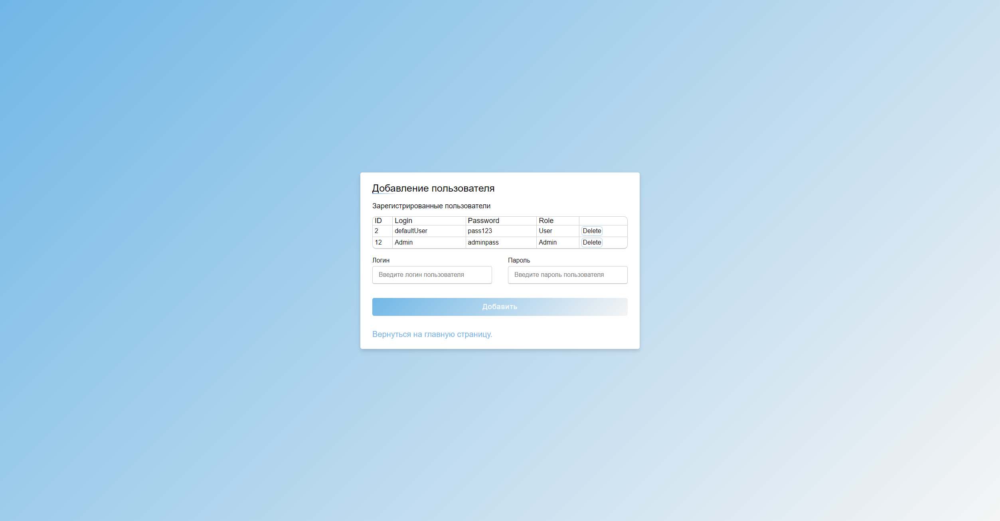
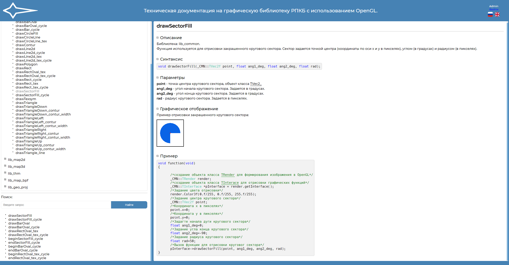

# Graphics Library Documentation Website

## Project Overview

This repository contains the source code for a **documentation website** that complements a graphics library written in C++ and OpenGL. The website provides comprehensive information about the library, including usage examples, user management features, and detailed function descriptions.

The website is built using **PHP** and managed with **Composer**, ensuring clean dependency management and easy configuration.

## Getting Started

To set up the website locally, follow these steps to configure Composer and start the web server:

### Prerequisites

- **PHP**: Make sure you have PHP installed on your machine. You can download it from [here](https://www.php.net/downloads).
- **Composer**: You need Composer to manage dependencies. Install it from [here](https://getcomposer.org/download/).

### Installation

1. **Clone the repository**:
    ```bash
   https://github.com/kochetkov25/Documentation.git
    ```

2. **Install Composer dependencies**:
    ```bash
    composer install
    ```

3. **Run the website**:
    Use OpenServer to run the project

4. **Configure Data Base connection**:
    You should configure connection to data base in config.php

## Screenshots

Here are a few key pages of the documentation website:

1. **Examples Page**:
   

2. **User Editing Page**:
   

3. **Function Description Page**:
   

## Features

- **Examples Page**: Learn how to use the graphics library with real-world examples and code snippets.
- **User Management**: The website allows administrators to manage users through a user-friendly interface.
- **Function Descriptions**: Each function in the library is thoroughly documented with details on usage, parameters, and return values.
